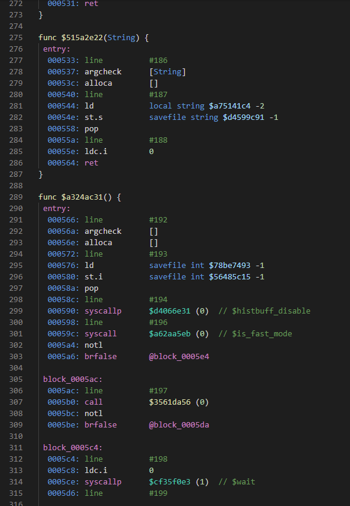

# majiro-py

Work-in-progress python library and tools created to aid in reversing the Majiro VN engine, in partnership with [AtomCrafty/MajiroTools](https://github.com/AtomCrafty/MajiroTools).

**Python Package Name:** `mjotool` 
**VSCode Extension Name:** `vscode-majiro`

**Warning:** The default branch is named `unstable` for a reason. This library *will* probably go through countless changes, refactors, and rewrites. Most of it, refactoring to catch up to the source C# project **mjotool** is based off of.

This library/tool is heavily tied to *and based on* [AtomCrafty/MajiroTools](https://github.com/AtomCrafty/MajiroTools), and additionally the repo's [Wiki knowledge base](https://github.com/AtomCrafty/MajiroTools/wiki).

***

## Contents

* Semi-functional Python tool for disassembling the Majiro script format. (`src/mjotool/`)
* VSCode extensions for disassembled Majiro IL script format syntax highlighting, WIP. (`plugin/vscode-majiro/`)

## Preview

*Disassembled Majiro IL from `console.mjo` using the VSCode language extension.*

## External links

* [trigger-segfault/unhash_name](https://github.com/trigger-segfault/unhash_name) - tool designed for recovering hashed variable and function names.